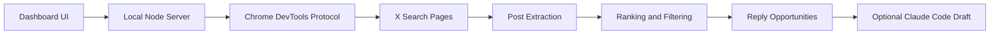

# X Hotspot Radar

一个本地运行的 X/Twitter 热点雷达，用来发现更值得回复的帖子。

它不自动发帖、不自动评论，也不绕过 X 的限制。它做的事情很简单：用你自己的 Chrome 登录态打开 X 搜索页，自动滚动、提取公开帖子数据，然后按浏览量、流速、互动率和领域相关度排序，帮你少刷信息流，多写几条真正值得写的回复。

## 功能

- 扫描 X 搜索结果，找到正在起量的帖子
- 支持自定义关键词组，一行一个关键词
- 支持黑名单，按昵称或 `@handle` 过滤作者
- 默认过滤成人/敏感内容
- 按热度、流速、互动率、相关度给出回复优先级
- 可选调用本地 Claude Code 生成中文回复草稿
- 所有评论都需要人工确认后再发布

## 适合谁

- 正在运营 X/Twitter 的 AI builder
- 做 build in public、独立开发、AI 接单、跨境电商内容的人
- 想在大 V 评论区写高质量回复，而不是随手刷屏的人
- 已经有 Claude Code，希望复用本地额度生成回复草稿的人

## 工作方式



## 环境要求

- Node.js 22+
- Google Chrome
- 一个已登录 X 的 Chrome 会话
- 可选：Claude Code CLI，用于生成回复草稿

## 快速开始

1. 安装依赖

```bash
npm install
```

当前项目没有第三方 npm 依赖，运行 `npm install` 只是为了生成本地 npm 状态。

2. 启动带远程调试端口的 Chrome

macOS:

```bash
open -na "Google Chrome" --args \
  --remote-debugging-port=9222 \
  --user-data-dir="$HOME/.x-hotspot-radar-chrome"
```

第一次打开时，Chrome 可能会询问是否允许远程调试。允许后，在这个 Chrome 窗口登录 X。

3. 启动雷达

```bash
npm start
```

4. 打开本地页面

[http://127.0.0.1:8787](http://127.0.0.1:8787)

## 使用方式

1. 保留默认关键词组，或自己编辑关键词组
2. 有临时热点时，在「临时关键词」里一行写一个关键词
3. 需要过滤某些作者时，在「黑名单」里一行写一个昵称或 `@handle`
4. 点击「找回复机会」
5. 优先查看「必回」和「可回」
6. 如需草稿，点击「生成回复」
7. 人工判断后再去 X 发布

## Claude Code 回复草稿

项目默认调用本机的 `claude` 命令：

```bash
claude -p "写一条中文回复"
```

如果你的 Claude Code 不在 PATH 里，可以通过环境变量指定：

```bash
CLAUDE_BIN=/path/to/claude npm start
```

如果没有 Claude Code，扫描和排序仍然可以正常使用，只是不能自动生成回复草稿。

## 环境变量

| 变量 | 默认值 | 说明 |
| --- | --- | --- |
| `PORT` | `8787` | 本地服务端口 |
| `CHROME_DEBUG_PORT` | `9222` | Chrome 远程调试端口 |
| `CHROME_DEBUG_URL` | `http://127.0.0.1:9222` | Chrome DevTools 地址 |
| `CDP_PROXY_URL` | 空 | 可选的 CDP 代理地址 |
| `CLAUDE_BIN` | `claude` | Claude Code CLI 路径 |

## 注意事项

- 这个项目只读取你自己 Chrome 里能看到的 X 页面，不使用 X 官方 API。
- 不建议高频、大规模抓取；请尊重 X 的服务条款和平台规则。
- 生成的回复只是草稿，不应无脑发布。
- 本项目不会保存你的 X 密码、Cookie 或 Claude 凭据。

## 开发

语法检查：

```bash
npm run check
```

本地启动：

```bash
npm start
```

## License

MIT
