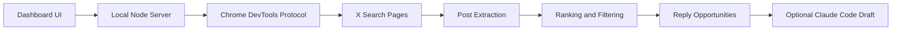

<p align="center">
  <a href="README.md">English</a> · <a href="README_ZH.md">简体中文</a> · <a href="README_JA.md">日本語</a> · <a href="README_KO.md">한국어</a> · <a href="README_ES.md">Español</a>
</p>

<p align="center">
  
</p>

# X Hotspot Radar

A locally-run hotspot radar for X/Twitter that helps you find posts more worth replying to.

It does not auto-post, does not auto-comment, and does not bypass X's limits. What it does is simple: using your own logged-in Chrome session, it opens X search pages, scrolls automatically, extracts public post data, and then ranks posts by view count, velocity, engagement rate, and topical relevance—helping you scroll the feed less and write more replies that are actually worth writing.

## Features

- Scans X search results to find posts that are gaining traction
- Supports custom keyword groups, one keyword per line
- Supports a blocklist, filtering authors by nickname or `@handle`
- Filters out adult/sensitive content by default
- Assigns reply priority based on heat, velocity, engagement rate, and relevance
- Opens the original post's detail page to fetch the full text before copying a prompt or generating a reply
- Optionally calls local Claude Code to generate a reply draft
- Optionally uses Xquik API as the scan source when an API key is configured
- Every comment requires manual confirmation before publishing

## Who It's For

- AI builders actively running an X/Twitter account
- People creating content around build in public, indie development, AI freelancing, and cross-border e-commerce
- People who want to write high-quality replies in big accounts' comment sections, rather than mindlessly spamming the feed
- People who already have Claude Code and want to reuse their local quota to generate reply drafts

## How It Works



## Requirements

- Node.js 22+
- Google Chrome
- A Chrome session already logged in to X
- Optional: Claude Code CLI, for generating reply drafts

## Quick Start

1. Install dependencies

```bash
npm install
```

This project currently has no third-party npm dependencies; running `npm install` is only to generate the local npm state.

2. Launch Chrome with the remote debugging port

macOS:

```bash
open -na "Google Chrome" --args \
  --remote-debugging-port=9222 \
  --user-data-dir="$HOME/.x-hotspot-radar-chrome"
```

The first time you open it, Chrome may ask whether to allow remote debugging. After allowing it, log in to X in this Chrome window.

3. Start the radar

```bash
npm start
```

4. Open the local page

[http://127.0.0.1:8787](http://127.0.0.1:8787)

## Usage

1. Keep the default keyword groups, or edit the keyword groups yourself
2. When there's a temporary hot topic, add one keyword per line in "临时关键词" (Temporary Keywords)
3. When you need to filter certain authors, add one nickname or `@handle` per line in "黑名单" (Blocklist)
4. Click "找回复机会" (Find Reply Opportunities)
5. Prioritize reviewing "必回" (Must Reply) and "可回" (Worth Replying)
6. If you want a draft, click "生成回复" (Generate Reply)
7. Use your own judgment before publishing on X

## Claude Code Reply Drafts

By default, the project calls the local `claude` command:

```bash
claude -p "写一条中文回复"
```

If your Claude Code is not in PATH, you can specify it via an environment variable:

```bash
CLAUDE_BIN=/path/to/claude npm start
```

Without Claude Code, scanning and ranking still work normally; you just can't auto-generate reply drafts.

## Environment Variables

| Variable | Default | Description |
| --- | --- | --- |
| `PORT` | `8787` | Local service port |
| `CHROME_DEBUG_PORT` | `9222` | Chrome remote debugging port |
| `CHROME_DEBUG_URL` | `http://127.0.0.1:9222` | Chrome DevTools address |
| `CDP_PROXY_URL` | empty | Optional CDP proxy address |
| `CLAUDE_BIN` | `claude` | Claude Code CLI path |
| `XQUIK_API_KEY` | empty | Optional Xquik API key for API-backed scans |
| `XQUIK_API_BASE_URL` | `https://xquik.com/api/v1` | Xquik REST API base URL |

## Optional Xquik Scans

Chrome remains the default scan source. To scan through Xquik instead, set `XQUIK_API_KEY`, restart the local server, open Advanced Filters, and switch Search Source to `Xquik API`.

Xquik scans use the same keyword groups, minimum-like filter, blacklist, whitelist, and ranking model as Chrome scans. The `People` result type stays Chrome-only because the Xquik source returns tweet search results.

## Notes

- This project only reads X pages that you can see in your own Chrome; it does not use X's official API.
- High-frequency, large-scale scraping is not recommended; please respect X's Terms of Service and platform rules.
- Generated replies are only drafts and should not be published blindly.
- This project does not store your X password, cookies, or Claude credentials.

## Development

Syntax check:

```bash
npm run check
```

Start locally:

```bash
npm start
```

## License

MIT

Xquik is an independent third-party service. Not affiliated with X Corp. "Twitter" and "X" are trademarks of X Corp.
