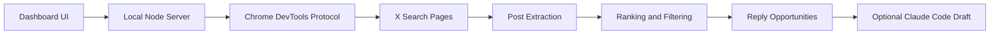

<p align="center">
  <a href="README.md">English</a> · <a href="README_ZH.md">简体中文</a> · <a href="README_JA.md">日本語</a> · <a href="README_KO.md">한국어</a> · <a href="README_ES.md">Español</a>
</p>

# X Hotspot Radar

Un radar de tendencias para X/Twitter que se ejecuta localmente y te ayuda a descubrir publicaciones que vale más la pena responder.

No publica automáticamente, no comenta automáticamente ni elude las restricciones de X. Lo que hace es sencillo: usando la sesión de tu propio Chrome con la sesión iniciada, abre las páginas de búsqueda de X, hace scroll automáticamente, extrae los datos de las publicaciones públicas y luego las ordena por número de visualizaciones, velocidad de crecimiento, tasa de interacción y relevancia temática, ayudándote a navegar menos por el feed y a escribir más respuestas que realmente valgan la pena.

## Funciones

- Escanea los resultados de búsqueda de X para encontrar publicaciones que están ganando tracción
- Admite grupos de palabras clave personalizados, una palabra clave por línea
- Admite una lista de bloqueo, filtrando autores por apodo o `@handle`
- Filtra contenido para adultos/sensible de forma predeterminada
- Asigna una prioridad de respuesta según la popularidad, la velocidad de crecimiento, la tasa de interacción y la relevancia
- Antes de copiar un prompt o generar una respuesta, abre primero la página de detalle de la publicación original para completar el texto completo
- Opcionalmente, invoca Claude Code local para generar un borrador de respuesta en chino
- Todos los comentarios requieren confirmación manual antes de publicarse

## Para quién es

- AI builders que están gestionando una cuenta de X/Twitter
- Personas que crean contenido sobre build in public, desarrollo indie, trabajos freelance de IA y comercio electrónico transfronterizo
- Personas que quieren escribir respuestas de alta calidad en las secciones de comentarios de cuentas influyentes, en lugar de saturar el feed sin criterio
- Personas que ya tienen Claude Code y quieren reutilizar su cuota local para generar borradores de respuestas

## Cómo funciona



## Requisitos

- Node.js 22+
- Google Chrome
- Una sesión de Chrome con la sesión ya iniciada en X
- Opcional: Claude Code CLI, para generar borradores de respuestas

## Inicio rápido

1. Instala las dependencias

```bash
npm install
```

Actualmente este proyecto no tiene dependencias npm de terceros; ejecutar `npm install` solo sirve para generar el estado local de npm.

2. Inicia Chrome con el puerto de depuración remota

macOS:

```bash
open -na "Google Chrome" --args \
  --remote-debugging-port=9222 \
  --user-data-dir="$HOME/.x-hotspot-radar-chrome"
```

La primera vez que lo abras, es posible que Chrome te pregunte si deseas permitir la depuración remota. Tras permitirlo, inicia sesión en X en esta ventana de Chrome.

3. Inicia el radar

```bash
npm start
```

4. Abre la página local

[http://127.0.0.1:8787](http://127.0.0.1:8787)

## Uso

1. Mantén los grupos de palabras clave predeterminados, o edítalos tú mismo
2. Cuando haya una tendencia temporal, añade una palabra clave por línea en «临时关键词» (Palabras clave temporales)
3. Cuando necesites filtrar a ciertos autores, añade un apodo o `@handle` por línea en «黑名单» (Lista de bloqueo)
4. Haz clic en «找回复机会» (Buscar oportunidades de respuesta)
5. Revisa con prioridad «必回» (Responder obligatoriamente) y «可回» (Vale la pena responder)
6. Si quieres un borrador, haz clic en «生成回复» (Generar respuesta)
7. Usa tu propio criterio antes de publicar en X

## Borradores de respuesta con Claude Code

De forma predeterminada, el proyecto invoca el comando local `claude`:

```bash
claude -p "写一条中文回复"
```

Si tu Claude Code no está en el PATH, puedes especificarlo mediante una variable de entorno:

```bash
CLAUDE_BIN=/path/to/claude npm start
```

Sin Claude Code, el escaneo y la ordenación siguen funcionando con normalidad; simplemente no podrás generar borradores de respuestas de forma automática.

## Variables de entorno

| Variable | Valor predeterminado | Descripción |
| --- | --- | --- |
| `PORT` | `8787` | Puerto del servicio local |
| `CHROME_DEBUG_PORT` | `9222` | Puerto de depuración remota de Chrome |
| `CHROME_DEBUG_URL` | `http://127.0.0.1:9222` | Dirección de Chrome DevTools |
| `CDP_PROXY_URL` | vacío | Dirección opcional del proxy CDP |
| `CLAUDE_BIN` | `claude` | Ruta del Claude Code CLI |

## Notas

- Este proyecto solo lee las páginas de X que puedes ver en tu propio Chrome; no utiliza la API oficial de X.
- No se recomienda el scraping de alta frecuencia y a gran escala; respeta los Términos de Servicio de X y las reglas de la plataforma.
- Las respuestas generadas son solo borradores y no deben publicarse a ciegas.
- Este proyecto no almacena tu contraseña de X, tus cookies ni tus credenciales de Claude.

## Desarrollo

Comprobación de sintaxis:

```bash
npm run check
```

Inicio local:

```bash
npm start
```

## License

MIT

## Historial de estrellas

[](https://star-history.com/#ai-martin-lau/x-hotspot-radar&Date)
