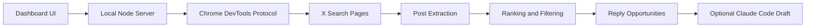

<p align="center">
  <a href="README.md">English</a> · <a href="README_ZH.md">简体中文</a> · <a href="README_JA.md">日本語</a> · <a href="README_KO.md">한국어</a> · <a href="README_ES.md">Español</a>
</p>

# X Hotspot Radar

返信する価値のある投稿を見つけるための、ローカルで動作する X/Twitter ホットスポットレーダーです。

自動投稿も、自動コメントもせず、X の制限を回避することもありません。やることはシンプルです。あなた自身の Chrome のログイン状態を使って X の検索ページを開き、自動でスクロールして公開投稿のデータを抽出し、表示数・伸びの速さ・エンゲージメント率・分野の関連度で並べ替えます。タイムラインを眺める時間を減らし、本当に書く価値のある返信をもっと書けるようにサポートします。

## 機能

- X の検索結果をスキャンし、伸び始めている投稿を見つける
- カスタムキーワードグループに対応、1 行 1 キーワード
- ブラックリストに対応、ニックネームまたは `@handle` で投稿者をフィルタリング
- 成人向け／センシティブなコンテンツをデフォルトでフィルタリング
- 注目度・伸びの速さ・エンゲージメント率・関連度に基づいて返信の優先度を提示
- プロンプトのコピーや返信の生成の前に、まず元投稿の詳細ページを開いて全文を補完
- ローカルの Claude Code を任意で呼び出し、中国語の返信ドラフトを生成
- すべてのコメントは公開前に手動での確認が必要

## こんな人に

- X/Twitter を運用している AI builder
- build in public、個人開発、AI 受託、越境 EC のコンテンツを作っている人
- 影響力のあるアカウントのコメント欄で、適当に投稿を量産するのではなく質の高い返信を書きたい人
- すでに Claude Code を持っていて、ローカルの利用枠を活用して返信ドラフトを生成したい人

## 仕組み



## 動作環境

- Node.js 22+
- Google Chrome
- X にログイン済みの Chrome セッション
- 任意：Claude Code CLI（返信ドラフトの生成に使用）

## クイックスタート

1. 依存関係をインストール

```bash
npm install
```

現在このプロジェクトにはサードパーティの npm 依存関係はなく、`npm install` を実行するのはローカルの npm 状態を生成するためだけです。

2. リモートデバッグポート付きで Chrome を起動

macOS:

```bash
open -na "Google Chrome" --args \
  --remote-debugging-port=9222 \
  --user-data-dir="$HOME/.x-hotspot-radar-chrome"
```

初回起動時に、Chrome がリモートデバッグを許可するか尋ねる場合があります。許可したら、この Chrome ウィンドウで X にログインしてください。

3. レーダーを起動

```bash
npm start
```

4. ローカルページを開く

[http://127.0.0.1:8787](http://127.0.0.1:8787)

## 使い方

1. デフォルトのキーワードグループをそのまま使うか、自分で編集する
2. 一時的なホットトピックがあるときは、「临时关键词」（一時キーワード）に 1 行 1 キーワードで入力する
3. 特定の投稿者をフィルタリングしたいときは、「黑名单」（ブラックリスト）に 1 行 1 つのニックネームまたは `@handle` を入力する
4. 「找回复机会」（返信の機会を探す）をクリックする
5. 「必回」（必ず返信）と「可回」（返信してもよい）を優先的に確認する
6. ドラフトが必要なら、「生成回复」（返信を生成）をクリックする
7. 自分で判断したうえで X に投稿する

## Claude Code 返信ドラフト

プロジェクトはデフォルトでローカルの `claude` コマンドを呼び出します:

```bash
claude -p "写一条中文回复"
```

Claude Code が PATH に含まれていない場合は、環境変数で指定できます:

```bash
CLAUDE_BIN=/path/to/claude npm start
```

Claude Code がなくても、スキャンと並べ替えは通常どおり使用できます。返信ドラフトを自動生成できないだけです。

## 環境変数

| 変数 | デフォルト値 | 説明 |
| --- | --- | --- |
| `PORT` | `8787` | ローカルサービスのポート |
| `CHROME_DEBUG_PORT` | `9222` | Chrome リモートデバッグポート |
| `CHROME_DEBUG_URL` | `http://127.0.0.1:9222` | Chrome DevTools のアドレス |
| `CDP_PROXY_URL` | 空 | 任意の CDP プロキシアドレス |
| `CLAUDE_BIN` | `claude` | Claude Code CLI のパス |
| `XQUIK_API_KEY` | 空 | API スキャン用の任意の Xquik API キー |
| `XQUIK_API_BASE_URL` | `https://xquik.com/api/v1` | Xquik REST API のベース URL |

## 任意の Xquik スキャン

Chrome は引き続きデフォルトのスキャンソースです。Xquik を使うには `XQUIK_API_KEY` を設定し、ローカルサーバーを再起動して、Advanced Filters の Search Source を `Xquik API` に切り替えます。

Xquik スキャンは、キーワードグループ、最低いいね数、ブロックリスト、ホワイトリスト、既存のランキングを再利用します。`People` タイプは Chrome 専用のままです。Xquik ソースは投稿検索結果を返すためです。

## 注意事項

- このプロジェクトは、あなた自身の Chrome で見える X のページを読み取るだけで、X の公式 API は使用しません。
- 高頻度・大規模なスクレイピングは推奨しません。X の利用規約とプラットフォームのルールを尊重してください。
- 生成される返信はあくまでドラフトであり、無条件に公開すべきではありません。
- このプロジェクトは、あなたの X のパスワード、Cookie、Claude の認証情報を保存しません。

## 開発

構文チェック:

```bash
npm run check
```

ローカルで起動:

```bash
npm start
```

## License

MIT

Xquik is an independent third-party service. Not affiliated with X Corp. "Twitter" and "X" are trademarks of X Corp.
