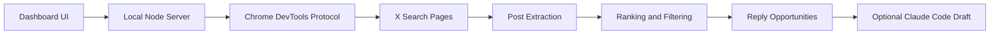

<p align="center">
  <a href="README.md">简体中文</a> · <a href="README_EN.md">English</a> · <a href="README_JA.md">日本語</a> · <a href="README_KO.md">한국어</a> · <a href="README_ES.md">Español</a>
</p>

# X Hotspot Radar

답글을 달 가치가 더 높은 게시물을 발견하기 위한, 로컬에서 실행되는 X/Twitter 핫스팟 레이더입니다.

자동으로 게시하거나 자동으로 댓글을 달지 않으며, X의 제한을 우회하지도 않습니다. 하는 일은 단순합니다. 당신 자신의 Chrome 로그인 상태를 사용해 X 검색 페이지를 열고, 자동으로 스크롤하여 공개 게시물 데이터를 추출한 다음, 조회수·확산 속도·참여율·분야 관련도 순으로 정렬해 줍니다. 피드를 덜 들여다보고, 정말로 쓸 가치가 있는 답글을 더 많이 쓸 수 있도록 도와줍니다.

## 기능

- X 검색 결과를 스캔하여 떠오르고 있는 게시물을 찾기
- 사용자 지정 키워드 그룹 지원, 한 줄에 키워드 하나
- 블랙리스트 지원, 닉네임 또는 `@handle` 로 작성자 필터링
- 성인용/민감 콘텐츠를 기본으로 필터링
- 인기도·확산 속도·참여율·관련도에 따라 답글 우선순위 제시
- 프롬프트를 복사하거나 답글을 생성하기 전에, 먼저 원본 게시물 상세 페이지를 열어 전문을 보완
- 선택적으로 로컬 Claude Code를 호출해 중국어 답글 초안 생성
- 모든 댓글은 게시 전에 수동 확인 필요

## 누구에게 적합한가

- X/Twitter를 운영 중인 AI builder
- build in public, 인디 개발, AI 외주, 해외 직구/크로스보더 이커머스 콘텐츠를 만드는 사람
- 인플루언서의 댓글창에서 아무렇게나 도배하는 것이 아니라 고품질 답글을 쓰고 싶은 사람
- 이미 Claude Code가 있어, 로컬 사용량을 재활용해 답글 초안을 생성하고 싶은 사람

## 작동 방식



## 요구 사항

- Node.js 22+
- Google Chrome
- X에 로그인된 Chrome 세션
- 선택 사항: Claude Code CLI (답글 초안 생성용)

## 빠른 시작

1. 의존성 설치

```bash
npm install
```

현재 이 프로젝트에는 서드파티 npm 의존성이 없으며, `npm install` 을 실행하는 것은 로컬 npm 상태를 생성하기 위한 것일 뿐입니다.

2. 원격 디버깅 포트를 켠 채로 Chrome 실행

macOS:

```bash
open -na "Google Chrome" --args \
  --remote-debugging-port=9222 \
  --user-data-dir="$HOME/.x-hotspot-radar-chrome"
```

처음 실행할 때 Chrome이 원격 디버깅을 허용할지 물어볼 수 있습니다. 허용한 후, 이 Chrome 창에서 X에 로그인하세요.

3. 레이더 시작

```bash
npm start
```

4. 로컬 페이지 열기

[http://127.0.0.1:8787](http://127.0.0.1:8787)

## 사용 방법

1. 기본 키워드 그룹을 그대로 두거나, 직접 키워드 그룹을 편집합니다
2. 일시적인 핫토픽이 있을 때는 「临时关键词」(임시 키워드)에 한 줄에 하나씩 키워드를 입력합니다
3. 특정 작성자를 필터링해야 할 때는 「黑名单」(블랙리스트)에 한 줄에 하나씩 닉네임 또는 `@handle` 을 입력합니다
4. 「找回复机会」(답글 기회 찾기)를 클릭합니다
5. 「必回」(반드시 답글)와 「可回」(답글 가능)를 우선적으로 확인합니다
6. 초안이 필요하면 「生成回复」(답글 생성)를 클릭합니다
7. 직접 판단한 후 X에 게시합니다

## Claude Code 답글 초안

프로젝트는 기본적으로 로컬의 `claude` 명령을 호출합니다:

```bash
claude -p "写一条中文回复"
```

Claude Code가 PATH에 없는 경우 환경 변수로 지정할 수 있습니다:

```bash
CLAUDE_BIN=/path/to/claude npm start
```

Claude Code가 없어도 스캔과 정렬은 정상적으로 사용할 수 있으며, 다만 답글 초안을 자동으로 생성할 수 없을 뿐입니다.

## 환경 변수

| 변수 | 기본값 | 설명 |
| --- | --- | --- |
| `PORT` | `8787` | 로컬 서비스 포트 |
| `CHROME_DEBUG_PORT` | `9222` | Chrome 원격 디버깅 포트 |
| `CHROME_DEBUG_URL` | `http://127.0.0.1:9222` | Chrome DevTools 주소 |
| `CDP_PROXY_URL` | 비어 있음 | 선택적 CDP 프록시 주소 |
| `CLAUDE_BIN` | `claude` | Claude Code CLI 경로 |

## 주의 사항

- 이 프로젝트는 당신 자신의 Chrome에서 볼 수 있는 X 페이지만 읽으며, X 공식 API를 사용하지 않습니다.
- 고빈도·대규모 스크래핑은 권장하지 않습니다. X의 서비스 약관과 플랫폼 규칙을 존중하세요.
- 생성된 답글은 초안일 뿐이며, 무분별하게 게시해서는 안 됩니다.
- 이 프로젝트는 당신의 X 비밀번호, Cookie, Claude 자격 증명을 저장하지 않습니다.

## 개발

문법 검사:

```bash
npm run check
```

로컬 실행:

```bash
npm start
```

## License

MIT

## 스타 히스토리

[](https://star-history.com/#ai-martin-lau/x-hotspot-radar&Date)
